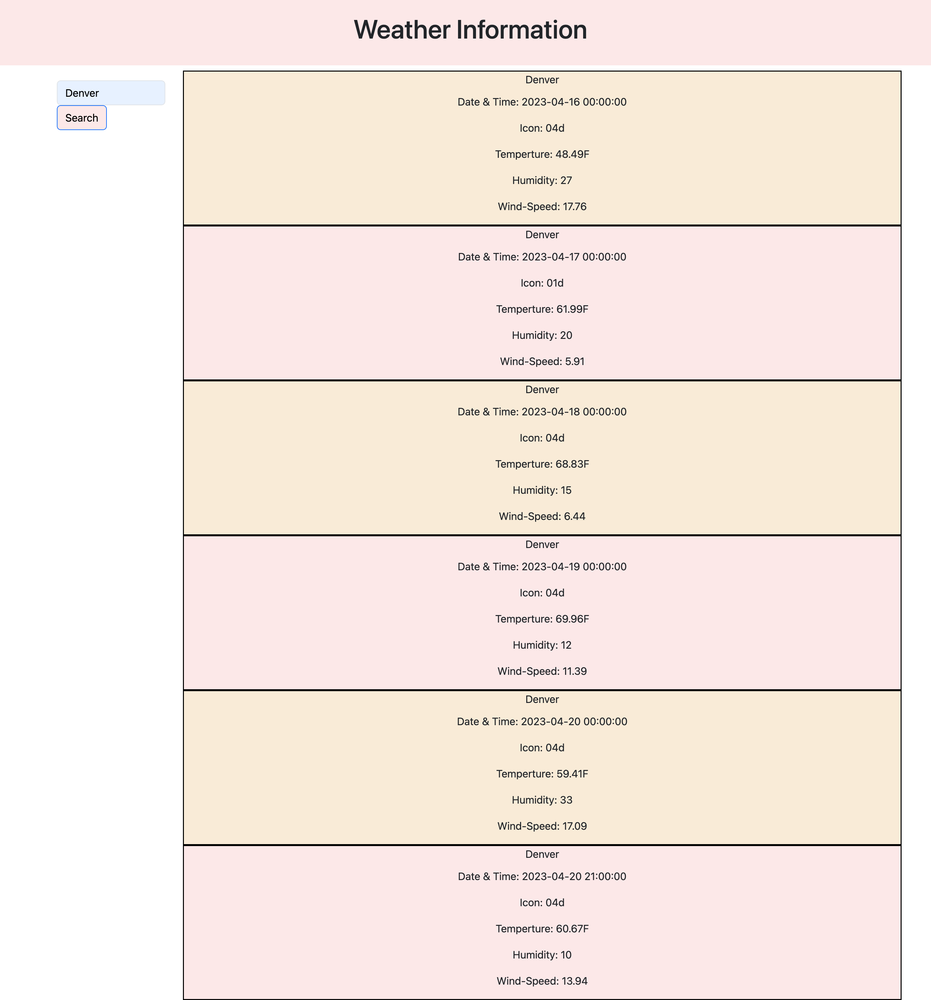

# 06 What's the weather?

## Description
In this application the webpage meets accessibility standards. I have fetched data from a weather website to display on my website by using functions and fetch. When you first open the webiste you will not see any information unless you seach a city. You can search a city by entering the name in the search box and clicking on the button search. You should then be presented with the current day, city name, temperature, humidity and wind speed. In additon, the forecast for that same city will display below for the next 5 days. The city's name you search is saved in local storage. 

## User Story

```
AS A traveler
I WANT to see the weather outlook for multiple cities
SO THAT I can plan a trip accordingly
```

## Acceptance Criteria

```
GIVEN a weather dashboard with form inputs
WHEN I search for a city
THEN I am presented with current and future conditions for that city and that city is added to the search history
WHEN I view current weather conditions for that city
THEN I am presented with the city name, the date, an icon representation of weather conditions, the temperature, the humidity, and the wind speed
WHEN I view future weather conditions for that city
THEN I am presented with a 5-day forecast that displays the date, an icon representation of weather conditions, the temperature, the wind speed, and the humidity
WHEN I click on a city in the search history
THEN I am again presented with current and future conditions for that city
```

## Screenshot

The following image shows the web application's appearance:



## Deploy Application

[Check the Weather](https://jjennifer.github.io/Jen-Weather-Dashboard-APIs/)